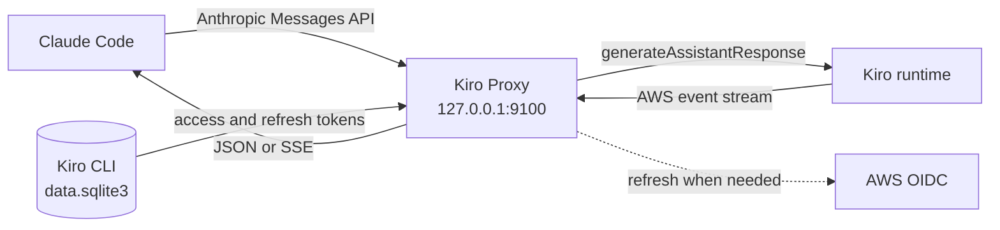

# Kiro Proxy

Run Claude Code against the models available in your Kiro subscription.

Kiro Proxy is a small, dependency-free Python server that presents the parts of the Anthropic Messages API used by Claude Code, translates each request into Kiro's `generateAssistantResponse` format, and translates Kiro's event stream back into Anthropic-compatible responses.

- One Python file
- Python standard library only
- Streaming, tool use, images, and multi-turn history
- Automatic Kiro access-token refresh
- Windows launcher included
- Model switching from Claude Code with `/model`

> [!NOTE]
> This is an unofficial compatibility proxy. It is not an Anthropic API server and does not call Anthropic. Requests go from your machine to Kiro using the credentials created by Kiro CLI.

## How it works



The proxy performs four jobs:

1. Reads the current Kiro login from the local Kiro CLI SQLite database.
2. Converts Anthropic messages, tools, tool results, images, and history into Kiro's request shape.
3. Decodes Kiro's binary AWS event stream.
4. Emits Anthropic-style JSON or server-sent events for Claude Code.

## Requirements

- Windows 10 or 11 for the included launcher. The Python server can also run on macOS or Linux.
- Python 3.8 or newer.
- [Kiro CLI](https://kiro.dev/docs/cli/setup), signed in with an account that has model access.
- [Claude Code](https://code.claude.com/docs/en/setup).

Check the commands before starting:

```powershell
python --version
kiro-cli --version
claude --version
```

## Quick start on Windows

### 1. Sign in to Kiro

```powershell
kiro-cli login
```

You only need to repeat this when the Kiro refresh token expires or is revoked.

### 2. Clone the repository

```powershell
git clone https://github.com/thejusdutt/kiro-proxy.git
cd kiro-proxy
```

The repository is private, so GitHub authentication is required.

### 3. Launch Claude Code

```powershell
claude-kiro.cmd
```

The launcher:

- checks whether port `9100` is already listening;
- starts `kiroproxy.py` in a hidden window when needed;
- points Claude Code at `http://127.0.0.1:9100`;
- passes every argument through to Claude Code.

For example:

```powershell
claude-kiro.cmd -p "Explain this repository"
```

The proxy remains running after Claude Code exits. Later sessions reuse it.

## Run in the foreground

Foreground mode is better when setting up the proxy or diagnosing a request:

```powershell
python kiroproxy.py --verbose
```

In another terminal:

```powershell
claude --settings claude-kiro-settings.json
```

A healthy startup looks similar to this:

```text
kiroproxy on http://127.0.0.1:9100  (region eu-central-1, default model claude-opus-5)
point Claude Code at it:  ANTHROPIC_BASE_URL=http://127.0.0.1:9100
```

Check the server directly:

```powershell
Invoke-RestMethod http://127.0.0.1:9100/health
Invoke-RestMethod http://127.0.0.1:9100/v1/models
```

## Manual setup

The launcher is optional. Start the proxy, then configure any Anthropic Messages API client to use its local URL.

### PowerShell

```powershell
$env:ANTHROPIC_BASE_URL = "http://127.0.0.1:9100"
$env:ANTHROPIC_AUTH_TOKEN = "kiro-local"
$env:ANTHROPIC_MODEL = "claude-opus-5"
claude
```

### Bash

```bash
export ANTHROPIC_BASE_URL=http://127.0.0.1:9100
export ANTHROPIC_AUTH_TOKEN=kiro-local
export ANTHROPIC_MODEL=claude-opus-5
claude
```

`kiro-local` is only a placeholder that satisfies clients expecting an auth value. The proxy does not send it to Kiro. Kiro authentication comes from the local SQLite database.

## Use the 1M context window

Kiro serves roughly a million tokens of context on `claude-opus-5`, but Claude Code sizes its own compaction from the model name, and plain `claude-opus-5` is in its table as a 200K model. Ask for the 1M variant and it will use the larger threshold:

```powershell
claude --settings claude-kiro-settings.json --model "claude-opus-5[1m]"
```

The proxy maps `claude-opus-5[1m]` back to `claude-opus-5` before calling Kiro, which has no separate 1M model ID. Without the suffix Claude Code refuses large reads with "would overflow the context window" long before Kiro would.

## Select a model

Use Claude Code's normal `/model` command with an exact Kiro model ID:

```text
/model gpt-5.6-sol
```

The proxy currently recognizes these IDs:

| Family | Exact model IDs |
| --- | --- |
| Automatic | `auto` |
| Claude Opus | `claude-opus-5`, `claude-opus-4.8`, `claude-opus-4.7`, `claude-opus-4.6`, `claude-opus-4.5` |
| Claude Sonnet | `claude-sonnet-5`, `claude-sonnet-4.6`, `claude-sonnet-4.5`, `claude-sonnet-4` |
| Claude Haiku | `claude-haiku-4.5` |
| GPT | `gpt-5.6-sol`, `gpt-5.6-terra`, `gpt-5.6-luna` |
| Other | `glm-5`, `minimax-m2.5`, `minimax-m2.1`, `deepseek-3.2`, `qwen3-coder-next` |

Model availability depends on the Kiro account, plan, region, and rollout. The list above is static; `GET /v1/models` reports the same configured list rather than querying Kiro live.

For GPT-5.6, Kiro describes the tiers as:

| Model | Use case | Kiro credit multiplier |
| --- | --- | ---: |
| `gpt-5.6-sol` | Hard multi-step and long-horizon work | 2.4x |
| `gpt-5.6-terra` | Balanced everyday agentic work | 1.2x |
| `gpt-5.6-luna` | Fast, high-volume work | 0.6x |

All three have a 272K context window according to [Kiro's GPT-5.6 announcement](https://kiro.dev/blog/gpt-5-6).

### Model resolution rules

- Exact IDs are passed to Kiro unchanged.
- `opus`, `sonnet`, and `haiku` map to the configured current models.
- Date-suffixed Claude IDs from Claude Code are normalized to Kiro's dotted IDs.
- Unsupported 1M suffixes such as `claude-opus-5[1m]` resolve to the matching base model.
- Unknown names fall back to `KIRO_DEFAULT_MODEL` instead of returning a model-name error.
- Exact IDs are case-sensitive. Use lowercase.

Run with `--verbose` to see both the resolved and requested model:

```text
-> gpt-5.6-sol (gpt-5.6-sol, 12 msgs, 9 tools) stream
```

Claude Code may display the requested or environment-selected label rather than the resolved Kiro model. The proxy log is the useful routing check.

### Change the default model

`claude-kiro.cmd` sets `ANTHROPIC_MODEL=claude-opus-5`, so new launcher sessions start on Opus even if Claude Code previously saved another `/model` choice. To make another model permanent, update `ANTHROPIC_MODEL` in both:

- `claude-kiro.cmd`
- `claude-kiro-settings.json`

Also update the top-level `model` value in `claude-kiro-settings.json` so the settings file is consistent.

`KIRO_DEFAULT_MODEL` is a fallback for missing or unknown request model names. It does not override a recognized model sent by Claude Code.

## Configuration

Command-line options take effect when the server starts:

```text
python kiroproxy.py [--host HOST] [--port PORT] [--db PATH] [--verbose]
```

| Option or variable | Default | Purpose |
| --- | --- | --- |
| `--host` | `127.0.0.1` | Listen address |
| `--port`, `KIRO_PORT` | `9100` | Listen port |
| `--db`, `KIRO_DB` | `%LOCALAPPDATA%/kiro-cli/data.sqlite3` on Windows | Kiro CLI credential database |
| `--verbose`, `-v` | off | Log payload size, history count, requests, and resolved models |
| `KIRO_DEFAULT_MODEL` | `claude-opus-5` | Fallback for unknown or absent model names |
| `KIRO_SMALL_MODEL` | `claude-haiku-4.5` | Target for Haiku-style small-model requests |
| `KIRO_TIMEOUT` | `600` | Kiro request timeout in seconds |
| `KIRO_MAX_PAYLOAD_BYTES` | `2700000` | Payload target before old history pairs are removed |
| `KIRO_THINKING` | `adaptive` | `adaptive`, `disabled`, or `off` to send no thinking field at all |
| `KIRO_EFFORT` | `high` | Reasoning effort: `low`, `medium`, `high`, `xhigh`, `max` |
| `KIRO_LOG` | `proxy.log` beside the script | Log file; rotates to `proxy.prev.log` at 4 MB |

The Windows launcher has port `9100` written into `claude-kiro.cmd`. If you change the server port, update the launcher and `ANTHROPIC_BASE_URL` in `claude-kiro-settings.json` too.

Environment variables are read when the Python process starts. Restart the proxy after changing them.

## Authentication and token refresh

Kiro Proxy reads these records from the database created by `kiro-cli login`:

| SQLite record | Used for |
| --- | --- |
| `auth_kv` token entry | Access token, refresh token, expiry, and region |
| `auth_kv` device-registration entry | OIDC client ID and client secret |
| `state` / `api.codewhisperer.profile` | Kiro profile ARN |

The proxy does not copy credentials to another file.

An access token with more than five minutes remaining is used directly. Inside the final five-minute window, the proxy serializes refresh work, re-reads the database in case Kiro CLI refreshed it first, and then refreshes through AWS OIDC if needed. The refreshed values are written back to the same database row.

If Kiro unexpectedly returns `401` or `403`, the proxy forces one refresh and retries once. If the refresh token itself has expired, run:

```powershell
kiro-cli login
```

## API compatibility

| Route | Behavior |
| --- | --- |
| `POST /v1/messages` | Streaming and non-streaming messages, tools, tool results, and images |
| `POST /v1/messages/count_tokens` | Rough local estimate based on text length |
| `GET /v1/models` | Static configured model list |
| `GET /health` | Liveness and active Kiro region |
| `GET /` | Same response as `/health` |

The server also accepts query strings used by Claude Code, such as `/v1/messages?beta=true`.

### Translation behavior

- Consecutive messages with the same role are merged.
- Conversations are forced to start with a user message and alternate user/assistant turns for Kiro.
- System text is prepended to the first available user turn.
- Anthropic tool schemas are sanitized before being sent to Kiro.
- Tool names longer than Kiro's 64-character limit are shortened with a hash suffix and restored in responses.
- Base64 PNG, JPEG, GIF, and WebP images are forwarded.
- `thinking` and `redacted_thinking` blocks are omitted because Kiro does not expose compatible reasoning blocks.
- Unknown content blocks are converted to text rather than rejected locally.
- Older history pairs are removed when the translated payload grows beyond `KIRO_MAX_PAYLOAD_BYTES`. Unlike Claude Code's own compaction this leaves no summary behind, so the trim is logged as a warning.
- Thinking arrives as Kiro `reasoningContentEvent` frames and is re-emitted as Anthropic `thinking` blocks with `thinking_delta` and `signature_delta`. Signed blocks are replayed to Kiro on later turns as `assistantResponseMessage.reasoningContent`.

## Security notes

The safe default is `127.0.0.1`. Keep it that way unless you control the network path.

> [!WARNING]
> The proxy does not validate the incoming `ANTHROPIC_AUTH_TOKEN`. Starting it with `--host 0.0.0.0` lets other reachable machines send requests through your Kiro account. Do not expose the port to a LAN, public interface, tunnel, or reverse proxy without adding authentication and transport security in front of it.

The Kiro access token is only sent to the regional Kiro runtime. Refresh credentials are only sent to the configured AWS OIDC or Kiro desktop-auth endpoint.

Verbose logs include model names, request counts, payload sizes, region, and error details. They do not intentionally log token values, but treat logs as local diagnostic data.

## Troubleshooting

### `no kiro token ... run kiro login`

Use the current Kiro CLI command:

```powershell
kiro-cli login
```

If Kiro stores its database somewhere else, provide it explicitly:

```powershell
python kiroproxy.py --db "C:/path/to/data.sqlite3" --verbose
```

### The selected model silently becomes Opus

The model name was not recognized and fell back to `KIRO_DEFAULT_MODEL`. Use an exact lowercase ID from `/v1/models`, then check the foreground log:

```text
-> resolved-model (requested-model, ...)
```

### Claude Code shows an API-token retry error

Read the proxy's foreground output before signing in again. An error shown by Claude Code as an API retry is not always authentication.

- `401` or `403`: the proxy refreshes once automatically. Run `kiro-cli login` if it continues.
- `429`: Kiro throttled the account. Wait and retry.
- `TOOL_USE_RESULT_MISMATCH`: history trimming separated a `tool_result` from its earlier `tool_use`. Run `/clear` or start a fresh Claude Code session.
- `INVALID_MODEL_ID`: the selected model is not available to the Kiro account or the id is wrong.

### Long sessions fail after many tool calls

The proxy removes old history in pairs after the translated payload exceeds 600KB. A cut can occasionally leave an old tool result without its matching tool call, and Kiro then returns `TOOL_USE_RESULT_MISMATCH`. `/clear` or a new session is the current workaround.

### Port 9100 is already in use

Find the process holding it:

```powershell
Get-NetTCPConnection -LocalPort 9100 | Select-Object LocalAddress, LocalPort, State, OwningProcess
```

Either reuse the running proxy or choose another port and update the client URL.

### Requests are cut off or slow

Kiro controls upstream throttling and output truncation. The proxy cannot recover text that Kiro did not return. Use foreground verbose mode to distinguish an upstream failure from a local translation error.

## Known limits

- Token counts are estimates (`text length / 4`), so Claude Code's context meter is approximate.
- Kiro has no system-prompt field, so the system prompt is prepended to the oldest user message. It is injected after history trimming and its size is reserved in the trim budget, because trimming it away leaves Kiro's own assistant persona in charge of the turn.
- Prompt caching needs no request fields: Kiro caches on content automatically, roughly halving the metered cost of a repeated prefix.
- Extended thinking works on Claude 4.6 and newer and on GPT-5.6. Claude 4.5 and older, including the Haiku small model, reject `additionalModelRequestFields` outright, so nothing is sent for them.
- Kiro's real limit is a token count, not a byte count, and bytes predict it badly: source code ran 1.58 MB at 54% context usage, English prose 3.8 MB at 92%, but a file padded with long runs of one character reached 65% in 691 KB. `KIRO_MAX_PAYLOAD_BYTES` is therefore set high enough that Claude Code's own compaction normally fires first, and `CONTENT_LENGTH_EXCEEDS_THRESHOLD` is caught, trimmed and retried for whatever bytes fail to predict.
- Kiro can refuse a conversation outright. It answers 200 with no content, so the refusal reason is surfaced as message text with `stop_reason: refusal` instead of an empty reply.
- The model list is maintained in source and can lag behind Kiro rollouts.
- Server-side Anthropic tools without a regular tool name are skipped.
- Long-history trimming can produce `TOOL_USE_RESULT_MISMATCH`; see troubleshooting above.
- Compatibility is aimed at Claude Code's use of the Messages API, not every Anthropic API feature.

## Development checks

There are no runtime dependencies to install. Before committing a change:

```powershell
python -m py_compile kiroproxy.py
python kiroproxy.py --help
```

For an end-to-end check, start the proxy with `--verbose`, call `/health`, then run a short Claude Code prompt and confirm that the log contains matching `->` and `<-` lines.
